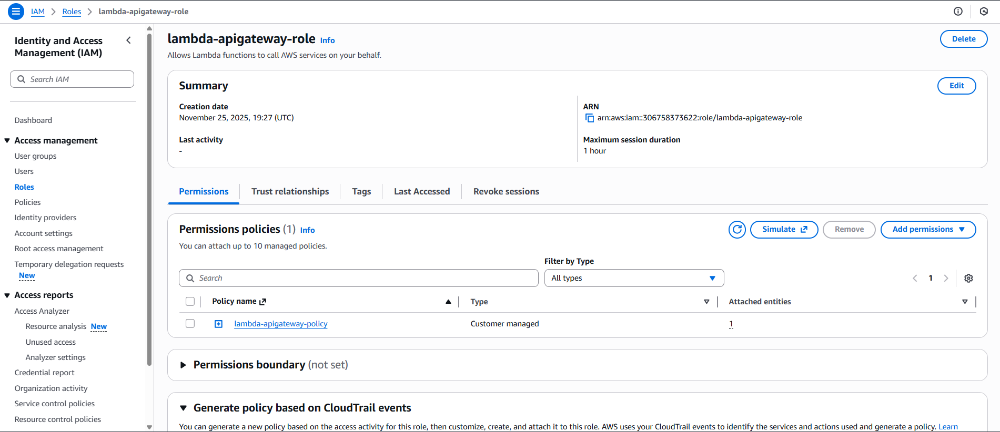
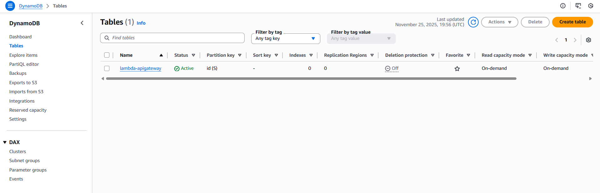
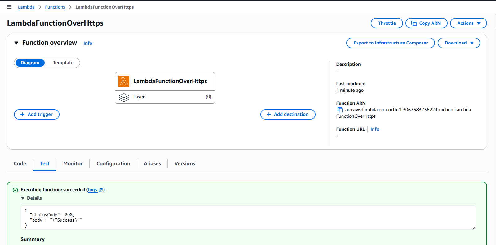

# AWS-Serverless-Microservice

## Project Overview

This project implements a serverless microservice architecture on AWS. While the initial description was brief, the repository appears to focus on utilizing AWS Lambda, API Gateway, and DynamoDB for building scalable and cost-effective applications. The included files suggest functionalities around data storage, retrieval, and manipulation using DynamoDB, triggered by API Gateway endpoints and handled by Lambda functions.


*Figure: High-level architecture of the serverless microservice using API Gateway, Lambda microservices, and DynamoDB tables.*

---

## Key Features & Benefits

*   **Serverless Architecture:** Leverage AWS Lambda for on-demand execution, eliminating the need for server management.
*   **Scalability:** Automatically scales resources based on demand, ensuring high availability.
*   **Cost-Effectiveness:** Pay only for the compute time you consume, reducing operational costs.
*   **API Gateway Integration:** Provides a secure and managed API interface for accessing your microservice.
*   **DynamoDB Persistence:** Utilizes DynamoDB for persistent data storage, offering scalability and flexibility.

## Prerequisites & Dependencies

Before setting up this project, ensure you have the following prerequisites installed and configured:

*   **AWS Account:** An active AWS account with appropriate permissions.
*   **AWS CLI:** The AWS Command Line Interface configured with your AWS credentials. Install via pip: `pip install awscli`
*   **Python 3.6+:**  Python 3.6 or a later version is required for running the Lambda function code.
*   **Boto3 Library:** The AWS SDK for Python (Boto3) is used for interacting with AWS services. Install via pip: `pip install boto3`
*   **Terraform (Optional):** While not explicitly mentioned, infrastructure as code tools like Terraform could greatly simplify deployment and management.
*   **SAM CLI (Optional):** The AWS Serverless Application Model CLI simplifies building and testing serverless applications.

## Installation & Setup Instructions

Follow these steps to deploy the microservice:

1.  **Create IAM Policy:**

    *   Create an IAM policy named `lambda-apigateway-policy` using the JSON content from the provided `Policy.json`. This policy grants necessary permissions for the Lambda function to access DynamoDB.


*Figure: Customer-managed IAM policy `lambda-apigateway-policy` granting access to DynamoDB and CloudWatch Logs.*

  ---

2.  **Create IAM Role:**

    *   Create an IAM role for the Lambda function.
    *   Attach the `lambda-apigateway-policy` you created in the previous step to this role.
    *   Trust relationship should allow Lambda functions to assume this role.



*Figure: IAM role `lambda-apigateway-role` with attached policy for Lambda execution and DynamoDB access.*

---

3.  **Create DynamoDB Table:**

    *   Create a DynamoDB table. The table schema will depend on your specific application requirements. Consider the attributes you'll be using to `GetItem`, `PutItem`, `UpdateItem`, etc. The images within the `Architecture` directory provide a potential table design.



*Figure: DynamoDB table `lambda-apigateway` configured with `id` as the partition key and on-demand capacity mode.*

---

4.  **Deploy Lambda Function:**

    *   Upload the `Lambdafunction.py` file as a Lambda function.
    *   Configure the Lambda function to use the IAM role you created earlier.
    *   Set the handler to `Lambdafunction.lambda_handler`.
    *   Configure Environment Variables (Optional) : If your Lambda depends on certain environment variables for configuration, set these here.
  


*Figure: Lambda function `LambdaFunctionOverHttps` successfully tested with a 200 OK response and `"Success"` body.*

---

5.  **Configure API Gateway:**

    *   Create an API Gateway API.
    *   Create a resource and method (e.g., POST) to trigger the Lambda function.
    *   Configure the integration request to map the API Gateway request to the Lambda function event format.
    *   Configure the integration response to map the Lambda function response back to the API Gateway response.
  


*Figure: POST method configuration for `/DynamoDBOperations` resource, integrated with Lambda and set to validate request body.*

---

6.  **Testing:**

    *   Use the "Test" functionality within the AWS Lambda console and the AWS API Gateway console to send a test JSON payload as shown in the `Testfunction.json` file.
    *   Verify the results in DynamoDB by using the DynamoDB console.
  


*Figure: Scan operation on `lambda-apigateway` table returning two items with 100% efficiency.*

---


*Figure: Successful POST request to `/DynamoDBOperations`, confirming item creation in DynamoDB with response metadata.*

---
## Usage Examples & API Documentation

The API expects a JSON payload with the following structure:

```json
{
  "operation": "create | get | update | delete | query | scan",
  "tableName": "YourDynamoDBTableName",
  "payload": {
    // DynamoDB operation specific parameters
    // Example for create:
    "Item": {
      "id": {"S": "unique_id"},
      "name": {"S": "Item Name"},
      "value": {"N": "123"}
    },
    // Example for get
    "Key": {
      "id": {"S": "unique_id"}
    }
  }
}
```

**Operations:**

*   **`create`:** Creates a new item in the DynamoDB table.  Requires the `Item` attribute in the `payload`.
*   **`get`:** Retrieves an item from the DynamoDB table. Requires the `Key` attribute in the `payload` representing the primary key.
*   **`update`:** Updates an existing item in the DynamoDB table.  Requires the `Key` and `UpdateExpression` attributes in the `payload`.
*   **`delete`:** Deletes an item from the DynamoDB table. Requires the `Key` attribute in the `payload`.
*   **`query`:** Queries the DynamoDB table. Requires the `KeyConditionExpression` and `ExpressionAttributeValues` attributes in the `payload`.
*   **`scan`:** Scans the entire DynamoDB table.  Use with caution on large tables as it can be expensive.  Optional `FilterExpression` and `ExpressionAttributeValues` in the `payload`.

**Example: Create Operation**

```json
{
  "operation": "create",
  "tableName": "MyTable",
  "payload": {
    "Item": {
      "id": {"S": "item123"},
      "name": {"S": "Example Item"},
      "value": {"N": "42"}
    }
  }
}
```

**Example: Get Operation**

```json
{
  "operation": "get",
  "tableName": "MyTable",
  "payload": {
    "Key": {
      "id": {"S": "item123"}
    }
  }
}
```

## Configuration Options

*   **TableName:**  The name of your DynamoDB table.  This can be passed in the API request or as an environment variable to the Lambda function.
*   **IAM Role:**  The IAM role assigned to the Lambda function must have appropriate permissions to access DynamoDB.

## Contributing Guidelines

1.  Fork the repository.
2.  Create a new branch for your feature or bug fix.
3.  Implement your changes, ensuring they are well-tested.
4.  Submit a pull request with a clear description of your changes.


## Acknowledgments

This project leverages the following AWS services:

*   AWS Lambda
*   Amazon API Gateway
*   Amazon DynamoDB
*   Boto3 (AWS SDK for Python)


